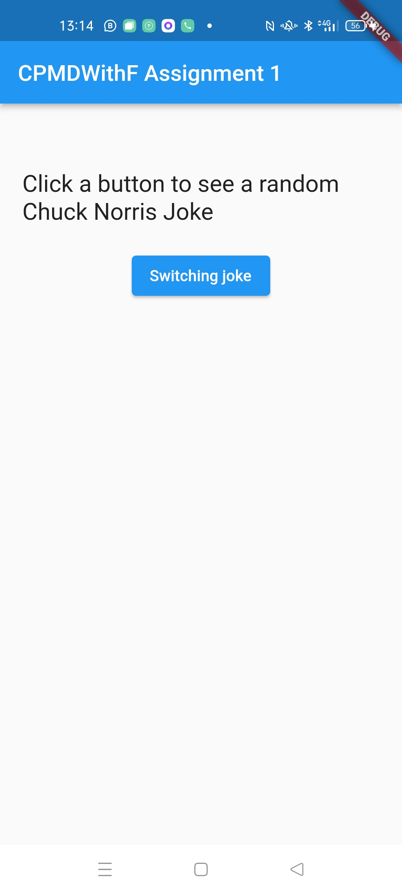
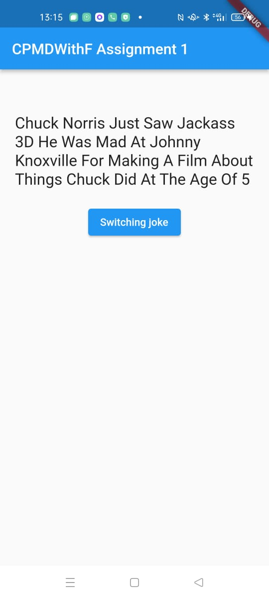
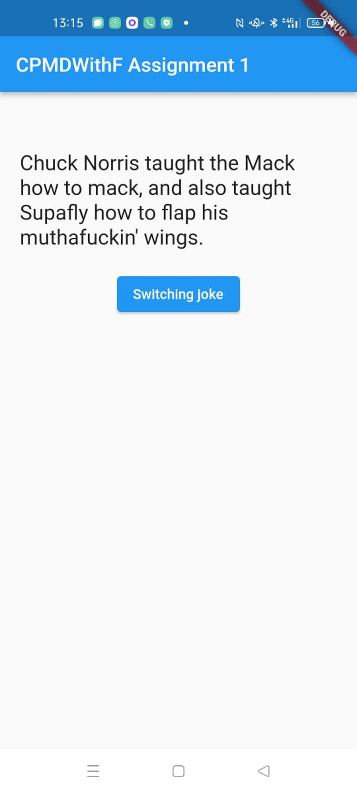

# Assignment 1, Cross-platform Mobile Development with Flutter
## Student: Arseniy Levochkin, BS20-SD-02, a.levochkin@innopolis.university

## Description

This project is based on a Flutter.

This particular app is created to show jokes and allow user to switch them. This app uses DIO to connect to Chuck Norris API in order to obtain a random joke. Also, it uses a json_serializable for a Joke Model. Every time a user switchs joke, app creates a request to API, after that it obtains a new joke, creates an instance of a Joke Model and shows it on a screen.

Link to GitHub repository: https://github.com/Arseniy172/Cross-platform-Mobile-Development-with-Flutter

## APK file
[APK file (is available on build/app/outputs/flutter-apk/app-release.apk)](build/app/outputs/flutter-apk/app-release.apk)

## Attached screenshots:

