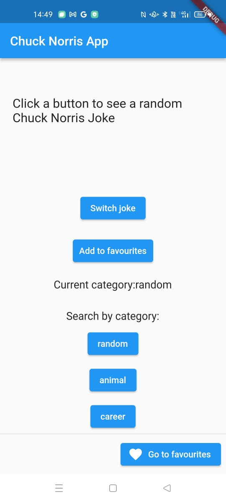
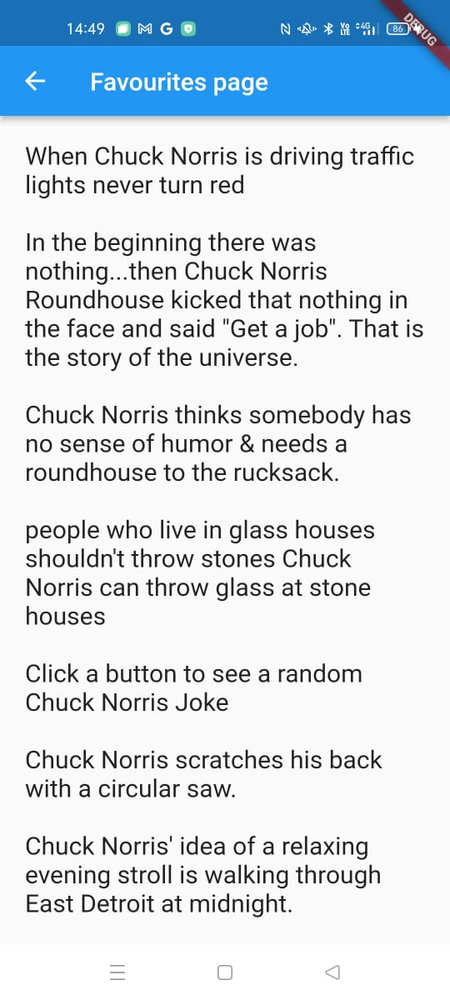
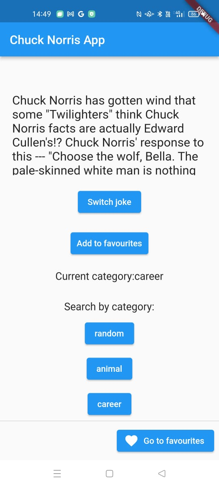

# Assignment 2, Cross-platform Mobile Development with Flutter
## Student: Arseniy Levochkin, BS20-SD-02, a.levochkin@innopolis.university

## Description

This project is based on a Flutter.

This particular app is created to show jokes and allow user to switch them. This app uses DIO to connect to Chuck Norris API in order to obtain a random joke. Also, it uses a json_serializable for a Joke Model. Every time a user switchs joke, app creates a request to API, after that it obtains a new joke, creates an instance of a Joke Model and shows it on a screen.

The updated version of a ChuckNorris app includes the following changes:
1. It's own designed icon
2. Storing jokes is updated and now it can be done despite the existance of the internet connection, as it saves data to Firebase and local file at the same time
3. UI and logic are separated
4. You can choose any category of jokes to see

Link to GitHub repository: https://github.com/Arseniy172/Cross-platform-Mobile-Development-with-Flutter

## APK file
[APK file (is available on build/app/outputs/flutter-apk/app-release.apk)](build/app/outputs/flutter-apk/app-release.apk)

## Attached screenshots:
### Main screen

### Saved to favourites

### Chosen category "career"

